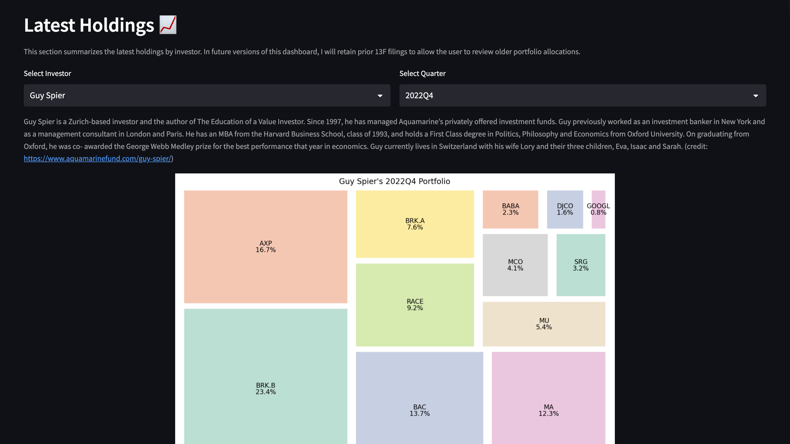

# **Superinvestors**

*“It is remarkable how much long-term advantage people like us have gotten by trying to be consistently not stupid, instead of trying to be very intelligent.”* **- Charlie Munger**

## Overview
This project served as my first experience using `streamlit` to build a dashboard.  I began with a simple concept - visualize the quarterly portfolio allocations of my favorite investors.  Currently, the dashboard only updates based on investor name.  In future quarters, I will add more data such that the quarter can be changed, too.  Below is a screenshot of the dashboard, which can be accessed [here](https://superinvestor-portfolios.streamlit.app/).    

  
## Core Files
* [Source Code for Superinvestor Portfolios App](superinvestor_dashboard.py)
* [Quarterly Portfolio Data](./data/superinvestor_data_2022Q4.csv)
* [Investor Bio Data](./data/investor_bios.csv)

## Resources
* [Dataroma](https://www.dataroma.com/m/home.php) - source of the superinvestor portfolio allocations based on quarterly 13F filings
